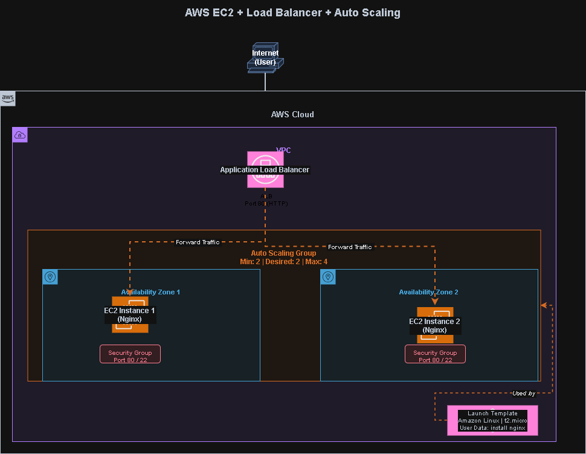
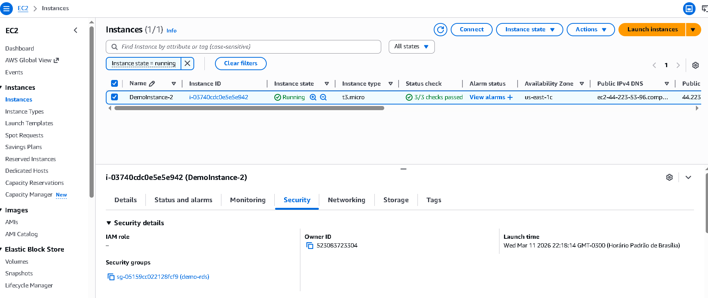
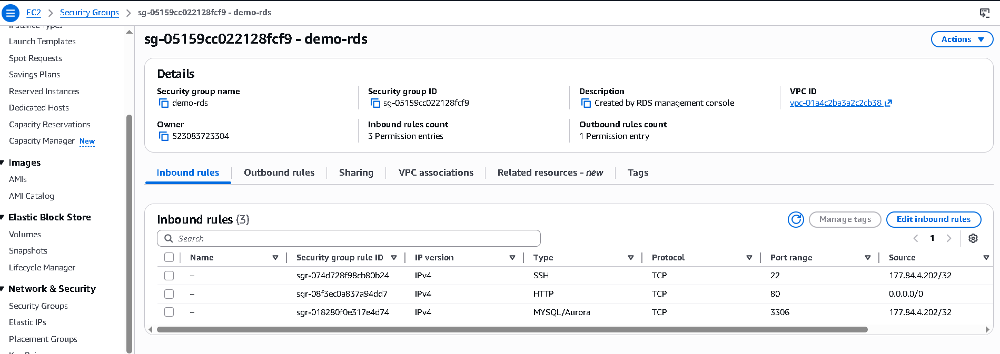
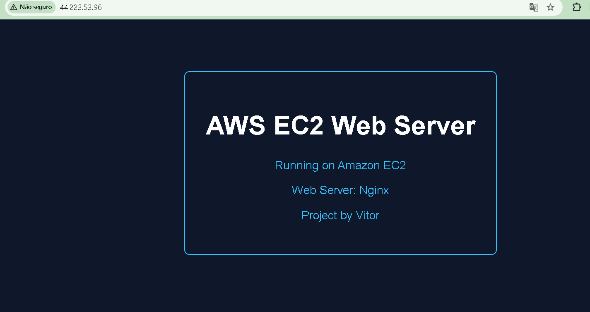
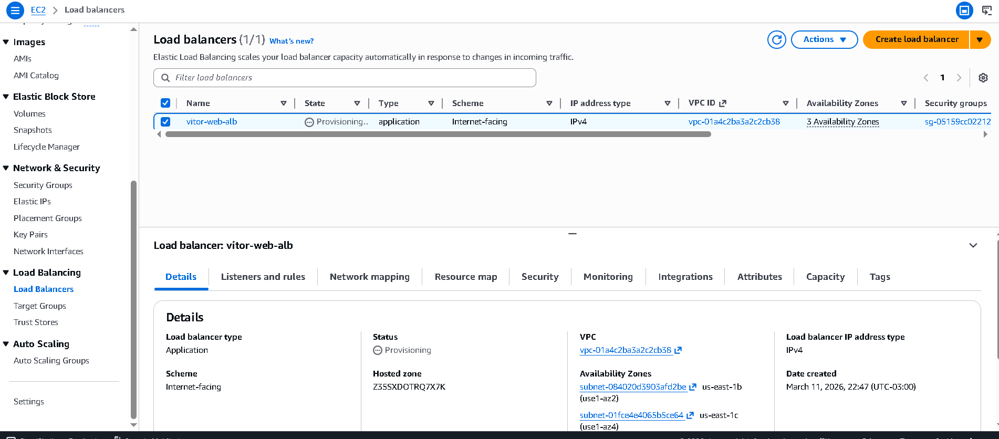
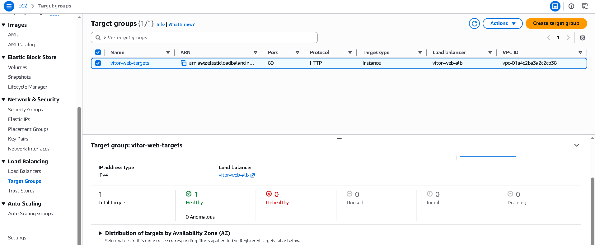
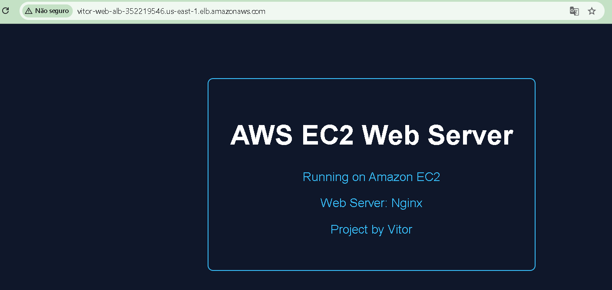
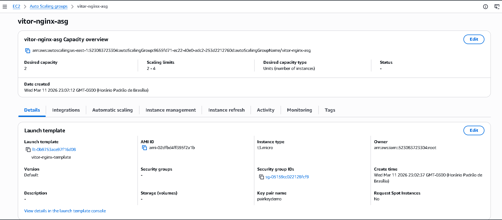
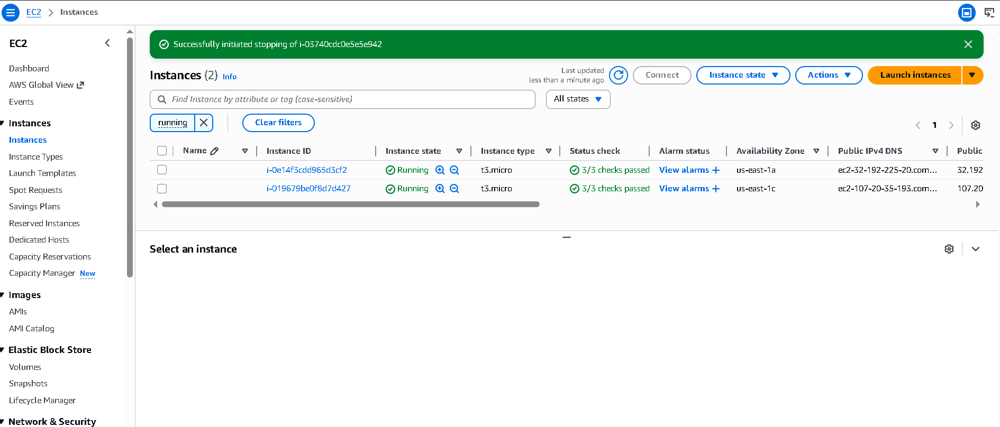
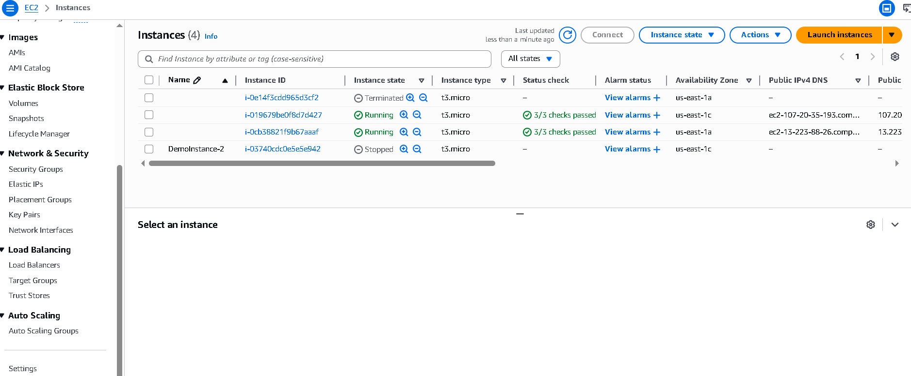

# AWS EC2 + Load Balancer + Auto Scaling Project

This project demonstrates a scalable and highly available web infrastructure built on AWS.

The objective of this project was to simulate a real-world cloud architecture using core AWS services, focusing on scalability, availability, and infrastructure best practices.

The environment uses EC2 instances running Nginx behind an Application Load Balancer, with automatic scaling handled by Auto Scaling Groups.

---

# Architecture Overview

The architecture ensures high availability and scalability by distributing traffic across multiple EC2 instances and automatically replacing unhealthy instances.

Architecture diagram:

---

# AWS Services Used

This project uses the following AWS services:

- Amazon EC2
- Application Load Balancer (Elastic Load Balancing)
- EC2 Auto Scaling
- Security Groups
- Launch Templates

These services together provide a scalable and fault-tolerant infrastructure.

---

# Architecture Flow

The request flow works as follows:

1. A user sends a request from the internet
2. The Application Load Balancer receives the request
3. The Load Balancer distributes the traffic across EC2 instances
4. EC2 instances run an Nginx web server
5. The Auto Scaling Group maintains the desired number of instances

Architecture flow:

Internet
│
▼
Application Load Balancer
│
├── EC2 Instance (Nginx)
└── EC2 Instance (Nginx)
↑
Auto Scaling Group

---

# Project Implementation Steps

## 1. EC2 Instance Setup

An EC2 instance was created using Amazon Linux.

Nginx was installed and configured as a web server.

Commands used:

sudo dnf update -y
sudo dnf install nginx -y
sudo systemctl start nginx
sudo systemctl enable nginx

Screenshots:

EC2 instance running:

Security group configuration:

Nginx default page running:

---

# 2. Application Load Balancer Configuration

An Application Load Balancer was created to distribute traffic between EC2 instances.

The Load Balancer listens on HTTP port 80 and forwards traffic to a target group.

Screenshots:

Load Balancer overview:

Target group health check:

Website accessed through the Load Balancer DNS:

---

# 3. Launch Template

A Launch Template was created to standardize the EC2 configuration used by Auto Scaling.

The template includes:

- Amazon Linux AMI
- Instance type (t2.micro)
- Security Group configuration
- User Data script to install and start Nginx automatically

Example User Data script:

#!/bin/bash
dnf install nginx -y
systemctl start nginx
systemctl enable nginx

---

# 4. Auto Scaling Group

An Auto Scaling Group was created to automatically manage EC2 instances.

Configuration used:

Minimum instances: 2  
Desired instances: 2  
Maximum instances: 4

Scaling policy:

Target tracking based on average CPU utilization.

This allows the infrastructure to automatically scale when demand increases.

Screenshots:

Auto Scaling Group overview:

Instances created automatically:

Load Balancer targets registered automatically:

---

# High Availability and Self-Healing

This architecture supports high availability and self-healing.

If an EC2 instance fails:

1. The Load Balancer detects the unhealthy instance
2. Auto Scaling replaces the failed instance automatically
3. Traffic continues to be distributed to healthy instances

This ensures continuous availability of the application.

---

# Project Structure

aws-ec2-loadbalancer-autoscaling/

README.md

architecture/
architecture-diagram.png

screenshots/

ec2/
ec2-instance-running.png
security-group-rules.png
nginx-page.png

load-balancer/
alb-overview.png
target-group-healthy.png
alb-nginx-working.png

autoscaling/
asg-overview.png
asg-instances.png
alb-targets-healthy.png

---

# Key Cloud Concepts Demonstrated

This project demonstrates important cloud architecture concepts:

- Load balancing
- Horizontal scaling
- High availability
- Self-healing infrastructure
- Infrastructure automation with Launch Templates

---

# Learning Outcome

Through this project, the following AWS concepts were practiced:

- Deploying web servers using EC2
- Configuring Application Load Balancers
- Implementing Auto Scaling Groups
- Designing scalable cloud architectures
- Monitoring instance health and traffic distribution

---

# Author

Vitor Tavares

Information Systems Student  
Cloud Computing Enthusiast
